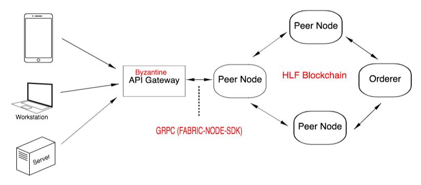
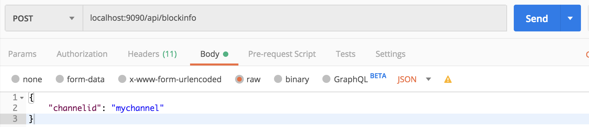
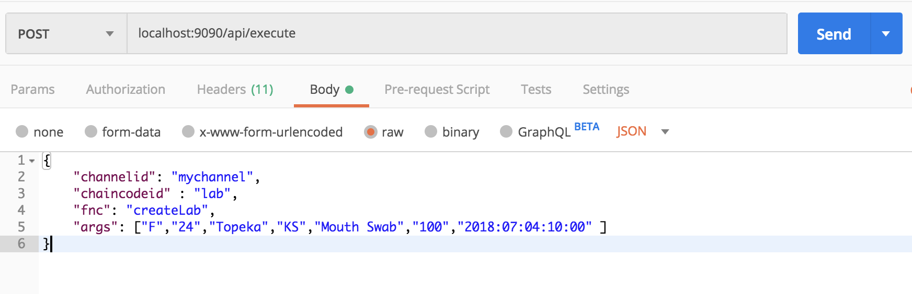
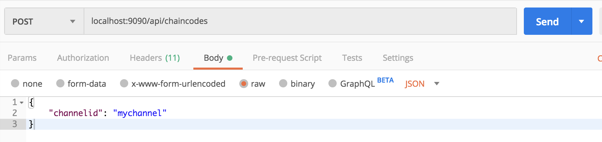
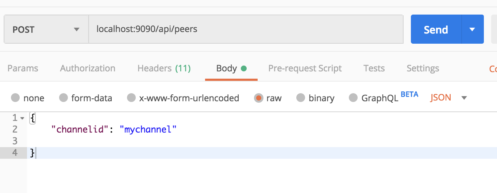
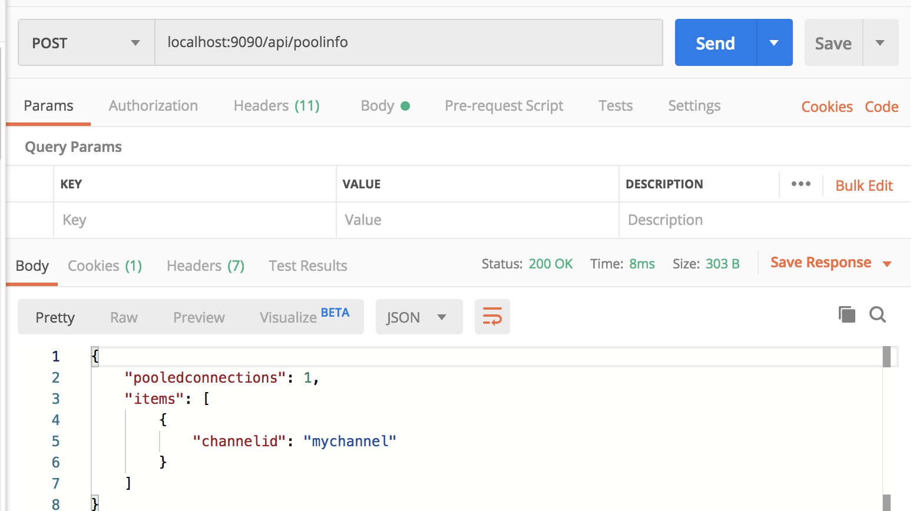
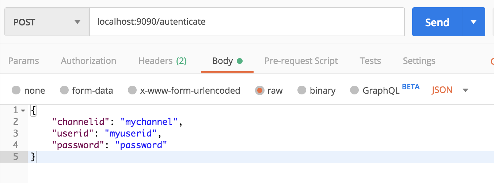

# byzantine-api-gateway

API gateway implementation providing access to Hyperledger Fabric (HLF) blockchain networks. Useful for executing chaincode (Smart Contracts) and querying the blockchain by client applications.



## Table of Contents

- [Architecture](#Architecture)
- [Installation](#Installation)
- [Configuration](#Configuration)
- [API](#API)
- [TESTS](#TESTS)
- [Authentication](#Authentication)
- [Websockets](#Websockets)
----

#### Architecture

The gateway is implemented with `Node.js` and uses the `Express` framework to provide RESTful `HTTP`-based endpoints that access HLF network peers using the FABRIC-NODE-SDK.  

APIs are defined to execute chaincode and query channel configuration information. 

#### Installation
You will need access to a Hyplerledger Fabric Peer Network Node for the API gateway to access. 

##### Requirements
* [Node](https://nodejs.org/en/download/) 8.9.x (v9.0+ not supported). Recommended version 8.9.4.
* Python (https://www.python.org/downloads/) 2.7+ (v3+ not supported)
* `Windows OS Only` - For 'rm' and 'cp' commands, use Powershell or add Git to PATH (C:\Program Files\Git\usr\bin) or install Cygwin.

###### HLF Network Access Credentials

The API Gateway utilizes the HLF Node.js client SDK, therefore an enrolled user credentials are required for the API endpoints to access

Here is an example of the public/private keys and user file in the `hfc-key-store` directory:


The server startup script copies credentials from the `wallet-path` config.js `hfc-key-store` value to the user's home `~/hfc-key-store` directory. Make sure the user home directory is writable.

Access credentials are created for a network by enrolling a user. Here is a [LINK](https://hlf.readthedocs.io/en/v1.1.0/write_first_app.html) describing how a user can be enrolled and credentials generated.  Go to the `Enroll the Admin User` section.

Clone the Repo:

> git clone https://github.com/in-the-keyhole/byzantine-api-gateway.git

Install the Dependencies:
> $ npm install

> The current keystore has credentials and properties set for the Hyperledger example networks. You can access other networks by modifying the `config.js` so that the `network_url` property points to a peer node address and an admin `USERID` property references an admin user and public/private keys located in the `hfc-key-store` folder.

```javascript
    module.exports = {
        loglevel: process.env.LOGLEVEL || "all",
        port: process.env.PORT || 9090,
        host: process.env.HOST || "localhost",
        wallet_path: process.env.KEYSTORE || "endpoint/hfc-key-store",
        user_id: process.env.USERID || "PeerAdmin",
        orderer_url: process.env.ORDERER_URL || "grpc://localhost:7050",
        network_url: process.env.NETWORK_URL || "grpc://localhost:7051",
        event_url: process.env.EVENT_URL || "grpc://localhost:7052",
    }
```

Launch the Gateway:
> $ ./run.sh

This will run the node app ./index.js for byzantine-api-gateway.

#### Configuration 

Configuration options for the Gateway are definedin the `./config.js` file and can be set using environment variables. The config file with default values are shown below. 

    module.exports = {
        loglevel: process.env.LOGLEVEL || "all",
        port: process.env.PORT || 9090,
        host: process.env.HOST || "localhost",
        wallet_path: process.env.KEYSTORE || "endpoint/hfc-key-store",
        user_id: process.env.USERID || "PeerAdmin",
        orderer_url: process.env.ORDERER_URL || "grpc://localhost:7050",
        network_url: process.env.NETWORK_URL || "grpc://localhost:7051",
        event_url: process.env.EVENT_URL || "grpc://localhost:7052",
        authenticate: process.env.AUTHENTICATE || true,
        authhandler: process.env.AUTHHANDLER || "./authentication/exampleAuthHandler.js",
        authvalidator: process.env.AUTHVALIDATOR || "./authentication/sessionValidator.js"

    }

You'll notice they are set to a localhost assumming Peer and Orderer are running locally. 

### API
RESTful API route definitions. 

### Block Info 
Current Hash and Number of Blocks.



### Execute Chaincode
Executes chaincode by specifying channel, chaincode name, function, and arguments.



### Installed Chaincodes
Returns installed chaincodes for a channel.



### Peers
Returns Peers in the network. 



### Connection Pool Info
For performance, the API Gateway maintains a connection pool. Current connections are returned with this API.



# Tests
Integration test scripts are defined in the `test` folder. These node.js scripts can be executed against a running API Gateway Instance.  Here are instructions on how to run and install 

    $ cd test 
    $ npm install 
    $ node apitests.js https://localhost:9090 mychannel

Substitute your own API host and channel name Results will be output to your console.

### Authenticate
If authenticate is set to `true`, calling this API route will invoke the specified session Validator where form parameters can be processed and authentication logic performed. See the [Authentication](#Authentication) section below for more information.



#### Authentication

API authentication is set to `false` by default, allowing them to be accessed without any authentication. If set to `true`, there are two types of authentication validation schemes that can be applied. Example implementations are provided for both. 

Authentication is enabled by setting the  `./config.js` `AUTHENTICATE` property to `true`. 

    ...
    authenticate: process.env.AUTHENTICATE || true,
    ...

A token-based or a session-based validation scheme can also be specified in the `./config.js` file.

##### Token-Based Validator

A token-based validator expects a valid `api-token` in each API requests. The gateway will execute the specified validator on each request. The validator module function is passed in a current request and response object, and it can pull an `API-TOKEN` from the request header, and validate the token. An example hard-coded token validator is supplied and shown below. 

    module.exports = function (req, res) {

        // Lookup token here, for test purposes token is hardcoded 

        if (req.headers['api-token'] == "changemeplease") {
            return true;
        }
        logger.error("Invalid API Token, request denied...");

        return false;
    }

The token validator is defined in a `JS` file and referenced in the `./config.js` and assigned to the `authvalidator` property, as shown below. 

    authvalidator: process.env.AUTHVALIDATOR || "./authentication/tokenValidator.js

You'll notice that an environment variable can be used to assign.  

Do note that the example above is not for production usage. You should replace the existing logic with logic that validates a token, such as JWT.  

##### Session-Based Validator

A session-based authentication validator expects an authenticated user identity object to be stored in the current session. An authenticate API route hase been pre-defined that when called, it will invoke a module defined in the module referenced in the `./config.js` `authhandler` property.  

    ...
    authhandler: process.env.AUTHHANDLER || "./authentication/exampleAuthHandler.js",
    ...

The authentication API route that invokes the handler is shown below.

    /authenticate  POST {key/values for authentication handler}

When this route is invoked, the `authhandler` module function will be invoked. This handling method can validate provided credentials and add them to the session object. An non-production example implementation is shown below. 

    ...

    module.exports = function (request,response) {

        var user = { userid: "testuserid" };

        request.session.user = user;

        logger.info("User session created");

        response.status(200);
        response.send("Authenticated")

    };

    ...

You'll notice that the example simply creates and assign a user object. In production this handler method should apply an actual authentication mechanism before assigning a user object to the session. 

You can find these examples in the `authentication` folder. 

### Websockets 
The gateway implements a web socket that can be opened by a client to listen for new blocks being added to the blockchain. Using the node SDK's EventHub implementation. 

Here is some example ReactJS code that defines a callback that will be invoked when a block is addded to the network:  

    var cb = function(noop, blocks) { console.log("Blocks Added")};
    const  socket = openSocket(<api server url>);
    function subscribeToBlocks(cb) {
    socket.on('blocks', blocks => cb(null, blocks));
    socket.emit('subscribeToBlocks', 1000);
    }

The above code would reside in a client-side web application that provides a callback that updates the UI in some way when new blocks are added to the blockchain. 
